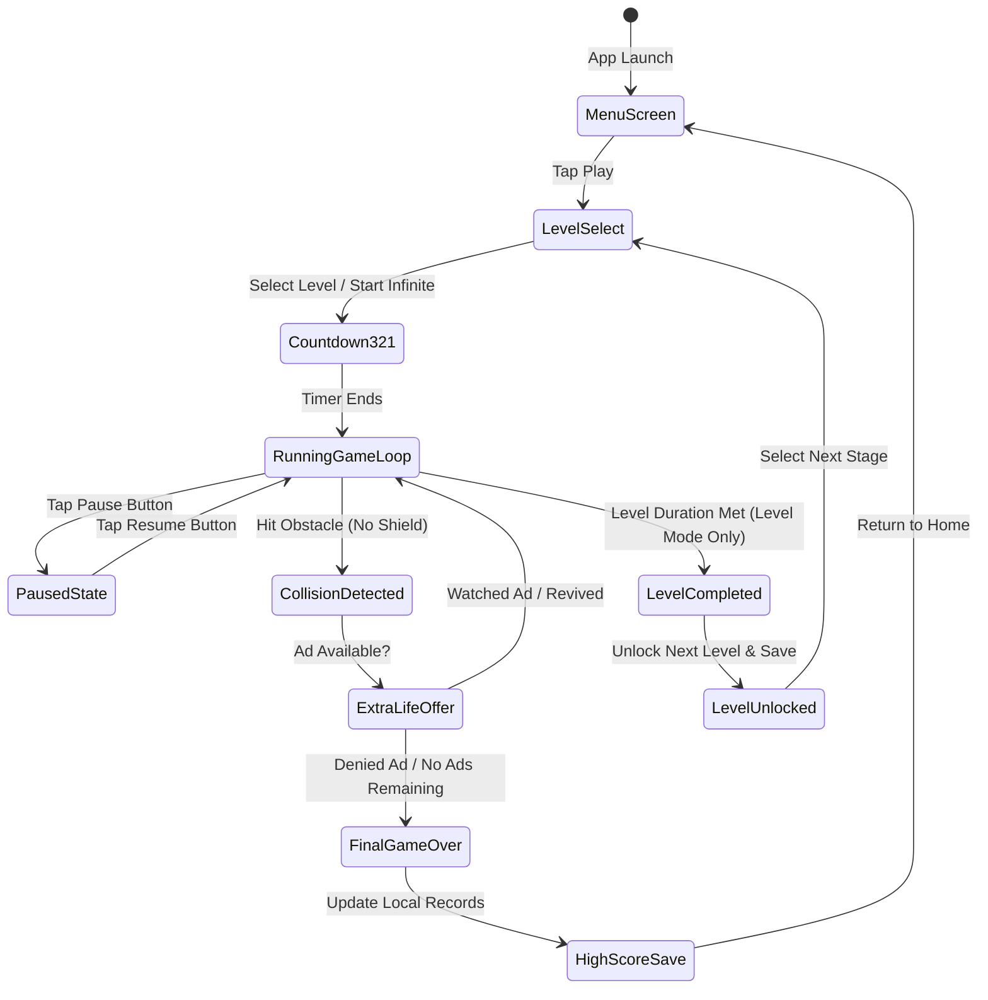
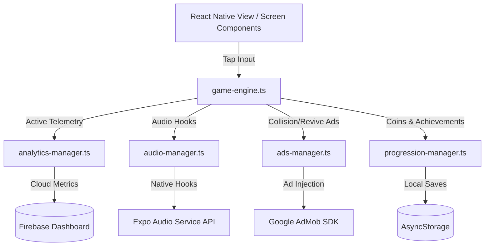

<div align="center">

<!-- Waving Neon Banner -->


<br/>

<!-- Interactive Typing Header -->
<h1>
  
</h1>

<p align="center">
  
  
  
  
  
</p>

</div>

---

## 🌌 The Cyberpunk Arcade on Your Screen

**Cyber Dash** is a high-speed, side-scrolling infinite mobile runner crafted with **React Native** and **Expo**. Immerse yourself in a glowing retro-futuristic synthwave world. Leap across bottomless pits, slide underneath descending forcefields, and sweep up neon glowing coins to power your run and dominate the high score charts.

---

## 🚀 Game Features Breakdown

<div align="center">

| Feature Area | Sub-Feature Details | Visual / Audio Feedback |
| :--- | :--- | :--- |
| **🕹️ Core Engine** | Proc-Gen Obstacles (Walls, Gaps, Moving barriers) | Progressive difficulty scaling & speed multipliers |
| **🏆 Progression System** | 10 distinct procedural levels, coin-based economy | Retro game-over dashboards & real-time high score saves |
| **⚡ Power-up Mechanics** | **Energy Shield** (ignores collision) • **Coin Magnet** | Interactive HUD status bars & duration rings |
| **🎵 Interactive Audio** | Seamless looping Custom Synthwave soundtrack | Dynamic retro SFX for jumping and impact collisions |
| **📱 Cross-Platform** | Tailored multi-gesture swipe & tap mobile controls | Fast startup (< 2s) & stable 60 FPS physics loop |

</div>

---

## 🎮 How to Play & Controls

<div align="center">
  <table style="border-collapse: collapse; border: none; border-radius: 12px; background: #070a13; box-shadow: 0 4px 20px rgba(0,0,255,0.1);">
    <tr>
      <td width="50%" align="center" style="padding: 15px; border-right: 1px dashed #7C3AED;">
        <h3>Jump Mechanism</h3>
        
        <p align="left" style="font-size: 0.9em; margin-top: 10px;">
          Tap anywhere on the lower 50% of your viewport to execute a fast vertical jump. Use this to clear glowing pink neon laser walls and massive ground gaps.
        </p>
      </td>
      <td width="50%" align="center" style="padding: 15px;">
        <h3>Slide Mechanism</h3>
        
        <p align="left" style="font-size: 0.9em; margin-top: 10px;">
          Swipe down rapidly anywhere on the upper 50% of the screen to enter a low-profile slide. Perfect for ducking underneath moving hovering energy barriers.
        </p>
      </td>
    </tr>
  </table>
</div>

<br/>

> [!TIP]
> **Pro Runner Tip:** The longer you survive, the higher your score multiplier goes. Focus on collecting the **Coin Magnet** power-up early in a run so you can dodge obstacles freely without deviating to gather coins manually!

---

## 🏗️ Interactive Game Architecture

Click on the tabs below to explore the core subsystems of Cyber Dash:

<details>
<summary>🎮 <b>1. The 60 FPS Game Loop Flow</b></summary>
<br/>

The physics, collision matrix, and speed multipliers are evaluated inside `lib/game-engine.ts` targeted at a consistent 60 frames per second using `requestAnimationFrame`. Here is the lifecycle of a play session:


</details>

<details>
<summary>🛡️ <b>2. Data Flow & Managers Ecosystem</b></summary>
<br/>

Cyber Dash divides critical services into isolated managers, preventing memory leaks and maintaining clean data boundaries:


</details>

---

## 🛠️ Technology Stack

```
🧬 FRAMEWORK     :: Expo SDK 54 / React Native 0.81
💻 LANGUAGE      :: TypeScript 5.9
🎨 STYLING       :: NativeWind (Tailwind CSS) / theme.config.js
💾 DATABASE      :: React Context / local AsyncStorage
🎬 ANIMATION     :: React Native Reanimated 4
🧪 UNIT TESTS    :: Vitest (27 assertions)
```

---

## 📂 Project Structure

```
cyber-dash/
├── app/                          # Expo Router Screens
│   ├── (tabs)/
│   │   ├── _layout.tsx           # Primary tab navigation
│   │   └── index.tsx             # Main dashboard
│   ├── game-screen.tsx           # Infinite Mode active gameplay & inputs
│   ├── game-over-screen.tsx      # High score telemetry dashboard
│   ├── level-game-screen.tsx     # Level Mode active gameplay
│   ├── level-game-over.tsx       # Collision failures
│   ├── level-complete-screen.tsx # Stage success dashboard
│   └── _layout.tsx               # Root App layout container
├── lib/                          # Decoupled Game Logic
│   ├── game-engine.ts            # High-performance delta-time loop
│   ├── ads-manager.ts            # Google AdMob SDK bridges
│   ├── analytics-manager.ts      # Active session logging
│   ├── progression-manager.ts    # Levels unlocked & coins tracker
│   ├── audio-manager.ts          # Playback & background looping
│   └── particle-system.ts        # Rendered jump & landing visual emitters
├── components/                   # UI Modules
│   ├── screen-container.tsx      # Safe area context wrapper
│   └── ui/
│       └── icon-symbol.tsx       # Dynamic vectorial SVG icons
├── assets/                       # Compressed WebP Media
│   ├── images/                   # App icon & branding assets
│   └── audio/                    # Synthwave sound files
└── package.json                  # System configuration parameters
```

---

## ⚙️ Interactive Customization Terminal

Explore how easy it is to customize and mod **Cyber Dash** to your liking:

<details>
<summary>🎨 <b>Modifying Theme & Glowing Color Palette</b></summary>

You can alter the global glowing neon visual accents. Open [theme.config.js](file:///c:/Users/admin/Desktop/Game/cyber-dash/theme.config.js):
```js
const themeColors = {
  primary: { light: '#00D9FF', dark: '#00D9FF' },   // Neon Cyan
  secondary: { light: '#FF007F', dark: '#FF007F' }, // Glowing Pink
  accent: { light: '#7C3AED', dark: '#7C3AED' },    // Cyber Purple
  background: '#0A0E27',                            // Void Dark Space
};
```
</details>

<details>
<summary>📈 <b>Tweaking Speed & Spawn Difficulties</b></summary>

Fine-tune global physical parameters. Open [lib/game-engine.ts](file:///c:/Users/admin/Desktop/Game/cyber-dash/lib/game-engine.ts):
```typescript
const BASE_SPEED = 5;              // Starting runner velocity
const MAX_SPEED = 12;              // Cap velocity ceiling
const SPEED_INCREMENT = 0.001;     // Runner acceleration per frame
const OBSTACLE_SPAWN_RATE = 1.5;   // Base spawn intervals in seconds
const GRAVITY = 9.8;               // Vertical acceleration pull
const JUMP_VELOCITY = -12;         // Inverted jump burst strength
```
</details>

<details>
<summary>🎁 <b>Configuring Level Mode Rewards & Power-up Durations</b></summary>

Increase power-up longevity. Open [lib/progression-manager.ts](file:///c:/Users/admin/Desktop/Game/cyber-dash/lib/progression-manager.ts):
```typescript
export const POWERUP_CONFIG = {
  SHIELD_DURATION: 8000,    // Duration in milliseconds (8 seconds)
  MAGNET_DURATION: 10000,   // Duration in milliseconds (10 seconds)
  LEVEL_COMPLETION_BONUS: 50 // Coins awarded on level success
};
```
</details>

---

## 🧪 Operational Commands & Testing

Cyber Dash includes a bulletproof **Vitest** setup validating physics calculation routines, AsyncStorage consistency, and collision bounds.

### Run Unit Tests
```bash
pnpm test
```
All 27 assertion checks execute in seconds:
```
✓ lib/game-engine.test.ts (27)
  ✓ Player Physics (Jump, gravity, slide bounds) - PASSED ✅
  ✓ Level progression & unlock states - PASSED ✅
  ✓ Progressive speed difficulty scaling - PASSED ✅
```

### Run Locally on Expo Go
```bash
# Install dependencies
pnpm install

# Spin up Metro Bundler
npm run dev
```
Scan the generated QR code in your terminal with your iOS or Android camera app running **Expo Go** to play instantly!

---

## 📊 High-Performance Metrics

- **Startup Latency:** `< 1.8 seconds` (on mid-range devices).
- **Target Frame Rate:** `60 FPS` locked utilizing lightweight `requestAnimationFrame` routines.
- **Resource Footprint:** `~52MB - 76MB` RAM utilization.
- **Bundle File size:** `~2.5 MB` (minified production archive).

---

## 📄 License
This project is licensed under the terms of the **MIT License**.

---

<div align="center">

### 🌟 Go Break the High Score, Runner!
*Dodge fast, grab power-ups, stay alive, and vibe to the synthwave beats!*


</div>
